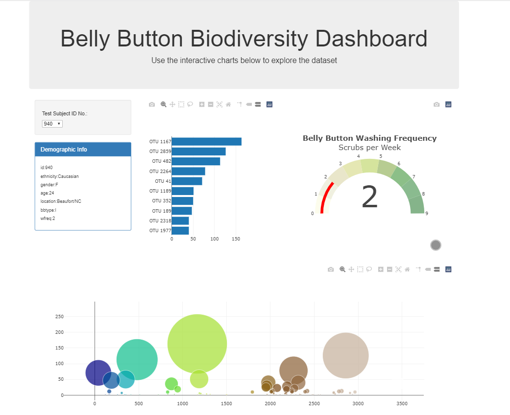
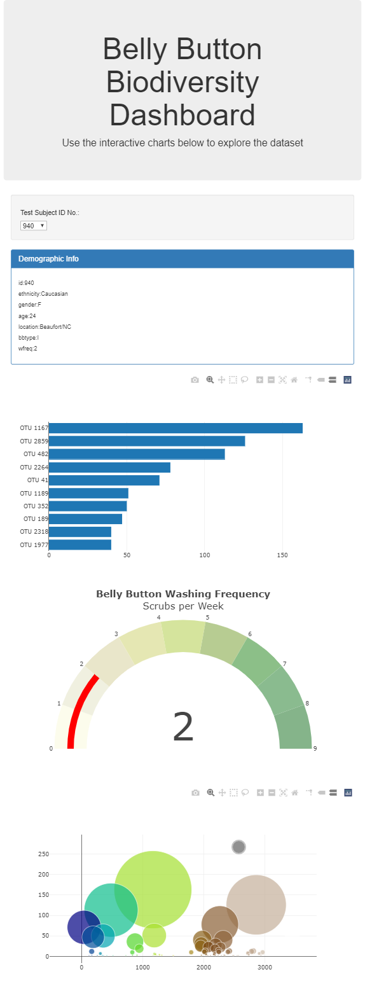
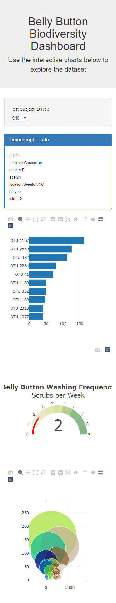

# Belly Button Biodiversity Dashboard
---

**URL**
---

[https://rahul99gangu.github.io/BellyButtonBiodiversity](https://rahul99gangu.github.io/BellyButtonBiodiversity/)

**Summary**
---

Create a realtime dashbroad to visualize the bacterial data for each volunteer in different demographic information. Each volunteer should be able to identify the top 10 bacterial species in their belly buttons. That way, if Improbable Beef identifies a species as a candidate to manufacture synthetic beef, they will be able to identify whether that species is found in quantity in their navel.

**Goals**
---

1. Create a bar chart of the top ten bacterial species in a volunteer’s navel. 
2. Create a bubble chart to visualize the relative frequency of all the bacterial species found.
3. The demographic information panel.

**Enhancements**

1. Create a Gauge chart belly button washing frequency scrubs per week

**Languages**
---

1. Javascript ES6 standard
2. Plotly.js
3. D3.js
4. Boostrap 3 
5. CSS3 
6. HTML5

**Software**
---

1. Visual Studion Code
2. Node.js (run local web application)

**Resources**
--
1. [plots.js](static/js/plots.js) <-- the javascript (Charting)
2. [index.html](index.html) <-- the html (Dashboard Viewer)
3. [samples.js](static/data/samples.json) <-- the data (Model)

**Screenshots**
---

**Desktop**

**Ipad or Surface**

**Iphone or Note10**

